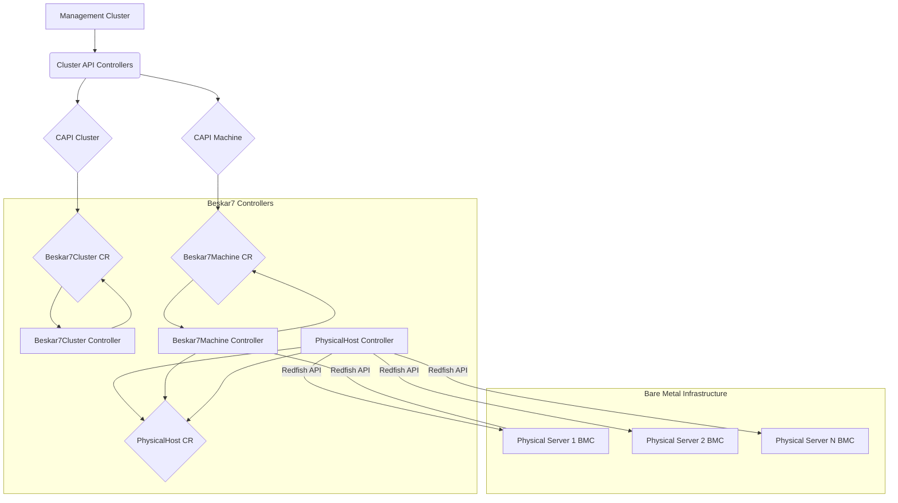

# Beskar7 Architecture

This document describes the high-level architecture of the Beskar7 Cluster API infrastructure provider.

## Overview

Beskar7 integrates with the Kubernetes Cluster API (CAPI) framework to manage the lifecycle of bare-metal hosts as Kubernetes nodes. It utilizes the Redfish API standard to communicate with the Baseboard Management Controllers (BMCs) of physical servers.

The core components are custom Kubernetes controllers that watch CAPI and Beskar7 custom resources:

*   Users or higher-level controllers (like CAPBK or CAPD) create CAPI `Cluster` and `Machine` resources.
*   These trigger the creation of corresponding `Beskar7Cluster` and `Beskar7Machine` resources.
*   Beskar7 controllers interact with `PhysicalHost` resources (representing the actual hardware) and the Redfish APIs on the BMCs to fulfill the desired state.

## Controllers

### `PhysicalHost` Controller

*   **Manages:** `PhysicalHost` Custom Resources.
*   **Responsibilities:**
    *   Represents a single physical server manageable via Redfish.
    *   Establishes and maintains a connection to the server's Redfish endpoint using provided credentials (stored in a Secret).
    *   Discovers basic hardware details (Manufacturer, Model, Serial Number) and status (Power State) via Redfish.
    *   Reports the host's readiness and availability status (`Available`, `Claimed`, `Error`, etc.) based on Redfish connectivity and whether it's in use.
    *   Performs deprovisioning actions (eject virtual media, power off) when the `PhysicalHost` resource is deleted (after it's released by any consumer).

### `Beskar7Machine` Controller

*   **Manages:** `Beskar7Machine` Custom Resources.
*   **Owned By:** CAPI `Machine` resource.
*   **Responsibilities:**
    *   Acts as the infrastructure provider for a specific Kubernetes node (`Machine`).
    *   Finds an `Available` `PhysicalHost` in the same namespace.
    *   **Claims** the `PhysicalHost` by setting its `spec.consumerRef` and `spec.bootIsoSource` fields.
    *   Configures the claimed `PhysicalHost`'s boot process based on the `Beskar7MachineSpec` (`provisioningMode`, `osFamily`, `imageURL`, `configURL`):
        *   **`PreBakedISO` mode:** Instructs the BMC (via Redfish `SetBootSourceISO`) to boot from the user-provided pre-configured ISO.
        *   **`RemoteConfig` mode:** Instructs the BMC (via Redfish `SetBootParameters` and `SetBootSourceISO`) to boot from a generic installer ISO with specific kernel parameters appended (e.g., `config_url=...`) to fetch configuration remotely.
    *   Monitors the state of the claimed `PhysicalHost`.
    *   Once the `PhysicalHost` indicates successful provisioning (e.g., reaches `StateProvisioned`), the `Beskar7MachineController` sets the `providerID` on the `Beskar7Machine` spec and marks its `InfrastructureReady` condition as `True`.
    *   When the owning `Machine` and the `Beskar7Machine` are deleted, releases the claimed `PhysicalHost` by clearing its `spec.consumerRef` and `spec.bootIsoSource`.

### `Beskar7Cluster` Controller

*   **Manages:** `Beskar7Cluster` Custom Resources.
*   **Owned By:** CAPI `Cluster` resource.
*   **Responsibilities:**
    *   Represents cluster-wide infrastructure concerns.
    *   **Derives the `ControlPlaneEndpoint`** by:
        *   Listing CAPI `Machine` resources belonging to the cluster with the control plane label (`cluster.x-k8s.io/control-plane`).
        *   Finding a `Machine` that is marked as `InfrastructureReady`.
        *   Extracting an IP address from the `Machine`'s `status.addresses` (preferring `InternalIP`).
        *   Populating the `Beskar7Cluster`'s `status.controlPlaneEndpoint` field.
    *   Sets the `ControlPlaneEndpointReady` condition based on whether an endpoint could be derived.
    *   Sets the overall `status.ready` field.
    *   **(Future):** May manage other cluster-scoped resources.
    *   **Discovers Failure Domains** by:
        *   Listing `PhysicalHost` resources in the same namespace.
        *   Extracting unique values from the `topology.kubernetes.io/zone` label on the `PhysicalHost` resources.
        *   Populating the `Beskar7Cluster`'s `status.failureDomains` field.

## Redfish Interaction

Controllers interact with BMCs via an internal Redfish client (`internal/redfish/client.go` and `gofish_client.go`) which acts as an abstraction layer over the `stmcginnis/gofish` library. This client handles:

*   Connecting and authenticating to Redfish endpoints.
*   Retrieving system information and power state.
*   Setting power state (On/Off).
*   Managing virtual media (Inserting ISOs, Ejecting).
*   Setting boot sources (e.g., virtual CD/DVD).
*   Attempting to set one-time UEFI boot parameters (via `UefiTargetBootSourceOverride`). 