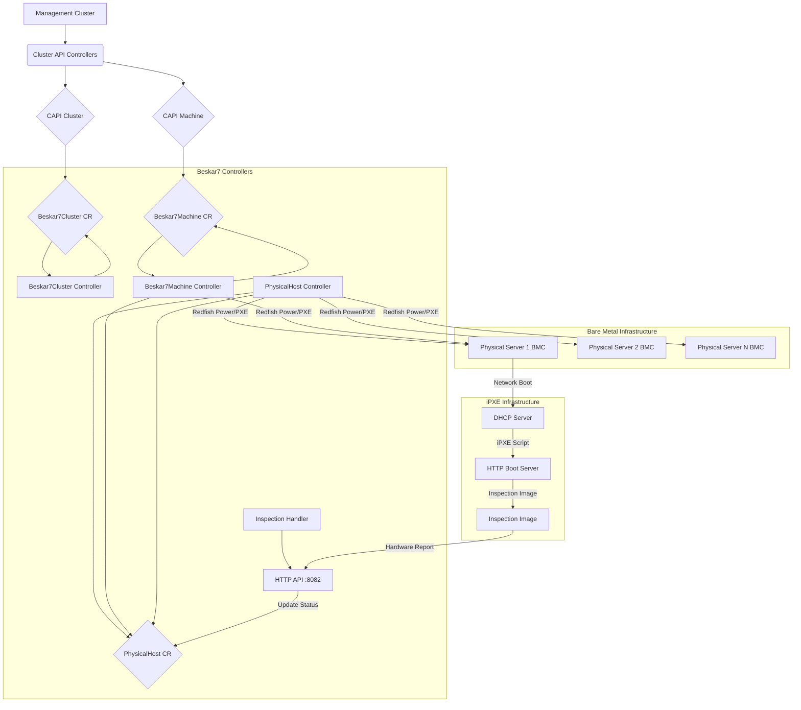

# Beskar7 Architecture

This document describes the high-level architecture of the Beskar7 Cluster API infrastructure provider.

## Overview

Beskar7 integrates with the Kubernetes Cluster API (CAPI) framework to manage the lifecycle of bare-metal hosts as Kubernetes nodes. It uses a **simple, reliable approach**: Redfish for power management + iPXE for network boot + hardware inspection.

The architecture follows these principles:
- **Simplicity**: No complex VirtualMedia or vendor-specific workarounds
- **Reliability**: Uses only universally-supported Redfish features
- **Vendor Agnostic**: Works with any Redfish-compliant BMC
- **Observable**: Rich hardware inspection data collected before provisioning

The core components are custom Kubernetes controllers that watch CAPI and Beskar7 custom resources:



**Workflow:**
1. Users or higher-level controllers create CAPI `Cluster` and `Machine` resources
2. These trigger the creation of corresponding `Beskar7Cluster` and `Beskar7Machine` resources
3. Beskar7Machine controller claims an available PhysicalHost
4. PhysicalHost is powered on with PXE boot flag via Redfish
5. Server network boots to inspection image via iPXE
6. Inspection image collects hardware details and reports back
7. Controller validates hardware meets requirements
8. Inspection image kexecs into final operating system
9. Machine becomes ready and joins the cluster

## Controllers

### `PhysicalHost` Controller

**Manages:** `PhysicalHost` Custom Resources

**Responsibilities:**
- Represents a single physical server manageable via Redfish
- Establishes and maintains connection to the server's BMC using provided credentials (stored in a Secret)
- Monitors power state via Redfish
- Discovers basic system information (Manufacturer, Model, Serial Number)
- Reports host availability status based on Redfish connectivity and claim status
- Stores inspection reports received from inspection image
- Performs cleanup actions when PhysicalHost is deleted (power off)

**States:**
- `Enrolling` - Establishing initial Redfish connection
- `Available` - Ready to be claimed by a machine
- `InUse` - Claimed by a Beskar7Machine
- `Inspecting` - Running hardware inspection
- `Ready` - Inspection complete and validated
- `Error` - Problem occurred

**Note:** This controller does NOT handle provisioning. It only manages power and tracks state.

### `Beskar7Machine` Controller

**Manages:** `Beskar7Machine` Custom Resources

**Owned By:** CAPI `Machine` resource

**Responsibilities:**
- Acts as the infrastructure provider for a specific Kubernetes node
- Implements the full inspection + provisioning workflow:

**Phase 1: Claim**
- Finds an `Available` `PhysicalHost` in the same namespace
- Claims the PhysicalHost by setting `spec.consumerRef`

**Phase 2: Boot Inspection**
- Connects to BMC via Redfish
- Sets one-time PXE boot flag
- Powers on the server
- Server network boots to inspection image via iPXE

**Phase 3: Wait for Inspection**
- Monitors PhysicalHost for inspection report
- Waits for inspection image to POST hardware details
- Timeout after 10 minutes if no report received

**Phase 4: Validate Hardware**
- Compares inspection report against `hardwareRequirements`:
  - Minimum CPU cores
  - Minimum memory GB
  - Minimum disk GB
- Rejects machine if requirements not met

**Phase 5: Provisioning**
- Inspection image kexecs into final OS
- Waits for final OS to report ready
- Sets `providerID` and marks `InfrastructureReady` condition as `True`

**Cleanup:**
- When deleted, releases the claimed PhysicalHost by clearing `spec.consumerRef`
- PhysicalHost transitions back to `Available` state

### `Beskar7Cluster` Controller

**Manages:** `Beskar7Cluster` Custom Resources

**Owned By:** CAPI `Cluster` resource

**Responsibilities:**
- Represents cluster-wide infrastructure concerns

**Derives the Control Plane Endpoint:**
1. Lists CAPI `Machine` resources with control plane label (`cluster.x-k8s.io/control-plane`)
2. Finds a `Machine` marked as `InfrastructureReady`
3. Extracts IP address from `Machine`'s `status.addresses` (preferring `InternalIP`, fallback to `ExternalIP`)
4. Populates `Beskar7Cluster`'s `status.controlPlaneEndpoint` field

**Discovers Failure Domains:**
1. Lists `PhysicalHost` resources in the same namespace
2. Extracts unique values from `topology.kubernetes.io/zone` label
3. Populates `Beskar7Cluster`'s `status.failureDomains` field

**Status Management:**
- Sets `ControlPlaneEndpointReady` condition
- Sets overall `status.ready` field

### `Inspection Handler`

**HTTP API:** Listens on port 8082

**Endpoint:** `POST /api/v1/inspection/{namespace}/{physicalhost-name}`

**Responsibilities:**
- Receives hardware inspection reports from inspection images
- Validates report structure
- Updates corresponding PhysicalHost resource with:
  - Inspection report data (CPUs, Memory, Disks, NICs, System info)
  - Inspection phase (`Complete` or `Failed`)
  - Inspection timestamp
- Triggers Beskar7Machine controller to continue provisioning

**Authentication:** Token-based (token passed via kernel parameters during iPXE boot)

## Redfish Interaction

Controllers interact with BMCs via an internal Redfish client (`internal/redfish/client.go` and `gofish_client.go`) which acts as an abstraction layer over the `stmcginnis/gofish` library.

**The Redfish client is intentionally minimal:**

```go
type Client interface {
    Close(ctx context.Context)
    GetSystemInfo(ctx context.Context) (*SystemInfo, error)
    GetPowerState(ctx context.Context) (redfish.PowerState, error)
    SetPowerState(ctx context.Context, state redfish.PowerState) error
    SetBootSourcePXE(ctx context.Context) error
    Reset(ctx context.Context) error
    GetNetworkAddresses(ctx context.Context) ([]NetworkAddress, error)
}
```

**What it does:**
- Connect and authenticate to Redfish endpoints
- Retrieve basic system information (manufacturer, model, serial)
- Get current power state
- Set power state (On, Off, ForceOff, GracefulShutdown)
- Set one-time PXE boot flag
- Reset system (for troubleshooting)
- Discover network interfaces and IP addresses

**What it does NOT do:**
- Virtual media operations (removed in v0.4.0)
- BIOS configuration (removed in v0.4.0)
- Boot parameter injection (removed in v0.4.0)
- Vendor-specific workarounds (removed in v0.4.0)

This minimal interface ensures vendor-agnostic operation and reduces complexity.

## Inspection Workflow

The inspection workflow is the core innovation in Beskar7 v0.4.0+. It provides reliable hardware discovery without vendor-specific code.

### Workflow Steps

```
┌─────────────────────────────────────────────────────────────────┐
│ 1. Beskar7Machine created, claims PhysicalHost                │
└────────────────────────┬────────────────────────────────────────┘
                         │
                         v
┌─────────────────────────────────────────────────────────────────┐
│ 2. Controller sets PXE boot flag via Redfish                  │
│    Controller powers on server via Redfish                     │
└────────────────────────┬────────────────────────────────────────┘
                         │
                         v
┌─────────────────────────────────────────────────────────────────┐
│ 3. Server network boots (DHCP -> iPXE chainload)              │
└────────────────────────┬────────────────────────────────────────┘
                         │
                         v
┌─────────────────────────────────────────────────────────────────┐
│ 4. iPXE fetches boot script from HTTP server                  │
│    Boot script includes: API URL, token, namespace, host name  │
└────────────────────────┬────────────────────────────────────────┘
                         │
                         v
┌─────────────────────────────────────────────────────────────────┐
│ 5. iPXE boots inspection image (Alpine Linux)                 │
│    Kernel parameters: beskar7.api=URL beskar7.token=XXX       │
└────────────────────────┬────────────────────────────────────────┘
                         │
                         v
┌─────────────────────────────────────────────────────────────────┐
│ 6. Inspection scripts run automatically:                      │
│    - Detect CPUs (lscpu, /proc/cpuinfo)                       │
│    - Detect Memory (free, /proc/meminfo)                      │
│    - Detect Disks (lsblk, smartctl)                           │
│    - Detect NICs (ip link, ethtool)                           │
│    - Collect system info (dmidecode)                          │
└────────────────────────┬────────────────────────────────────────┘
                         │
                         v
┌─────────────────────────────────────────────────────────────────┐
│ 7. Inspection image POSTs report to Beskar7 API               │
│    POST /api/v1/inspection/{namespace}/{host}                 │
│    Body: JSON with all hardware details                       │
└────────────────────────┬────────────────────────────────────────┘
                         │
                         v
┌─────────────────────────────────────────────────────────────────┐
│ 8. Inspection Handler updates PhysicalHost status             │
│    Sets InspectionReport field                                 │
│    Sets InspectionPhase to Complete                            │
└────────────────────────┬────────────────────────────────────────┘
                         │
                         v
┌─────────────────────────────────────────────────────────────────┐
│ 9. Beskar7Machine controller validates hardware               │
│    Checks minCPUCores, minMemoryGB, minDiskGB                 │
│    If validation fails: mark machine as failed                 │
│    If validation passes: continue to provisioning              │
└────────────────────────┬────────────────────────────────────────┘
                         │
                         v
┌─────────────────────────────────────────────────────────────────┐
│ 10. Inspection image downloads final OS                       │
│     Downloads target image (e.g., Kairos tar.gz)              │
│     Extracts kernel and initrd                                 │
│     Prepares kexec command                                     │
└────────────────────────┬────────────────────────────────────────┘
                         │
                         v
┌─────────────────────────────────────────────────────────────────┐
│ 11. Kexec into final OS                                       │
│     Server reboots directly into production OS                 │
│     No additional network boot needed                          │
└────────────────────────┬────────────────────────────────────────┘
                         │
                         v
┌─────────────────────────────────────────────────────────────────┐
│ 12. Final OS boots and joins cluster                          │
│     Beskar7Machine marked as Ready                             │
│     Node appears in cluster                                    │
└─────────────────────────────────────────────────────────────────┘
```

### Inspection Image

The inspection image is a lightweight Alpine Linux environment with hardware detection tools. It is maintained in a separate repository: https://github.com/projectbeskar/beskar7-inspector

**Components:**
- Base: Alpine Linux 3.19
- Tools: dmidecode, lshw, lsblk, smartctl, ethtool, kexec-tools
- Scripts: Hardware detection, report generation, kexec boot
- Size: <100 MB

**Kernel Parameters:**
```
beskar7.api=http://controller.cluster.local:8082
beskar7.token=secret-inspection-token
beskar7.namespace=default
beskar7.host=server-01
beskar7.target=http://boot-server/images/kairos.tar.gz
beskar7.config=http://boot-server/configs/node-config.yaml
```

## API Types

### PhysicalHost

**Key Fields:**

```yaml
spec:
  redfishConnection:
    address: "https://bmc-ip"
    credentialsSecretRef: "bmc-credentials"
    insecureSkipVerify: false
  consumerRef:  # Set by Beskar7Machine when claimed
    apiVersion: infrastructure.cluster.x-k8s.io/v1beta1
    kind: Beskar7Machine
    name: worker-01
    namespace: default

status:
  state: Available  # Enrolling, Available, InUse, Inspecting, Ready, Error
  ready: true
  inspectionPhase: Complete  # Pending, Booting, InProgress, Complete, Failed, Timeout
  inspectionReport:
    timestamp: "2025-11-27T10:00:00Z"
    cpus:
      count: 2
      cores: 16
      threads: 32
      model: "Intel Xeon E5-2640 v4"
      architecture: "x86_64"
      mhz: 2400
    memory:
      totalBytes: 68719476736
      totalGB: 64
    disks:
    - device: "/dev/sda"
      sizeBytes: 500107862016
      sizeGB: 500
      type: "SSD"
      model: "Samsung 870 EVO"
      serial: "S5H1NS0T123456"
    nics:
    - interface: "eth0"
      macAddress: "00:25:90:f0:79:00"
      linkStatus: "up"
      speedMbps: 1000
      driver: "ixgbe"
    system:
      manufacturer: "Dell Inc."
      model: "PowerEdge R730"
      serialNumber: "ABC1234"
      biosVersion: "2.15.0"
      bmcAddress: "192.168.1.100"
```

### Beskar7Machine

**Key Fields:**

```yaml
spec:
  # Inspection image URL (iPXE boot script or kernel/initrd)
  inspectionImage: "http://boot-server/ipxe/inspect.ipxe"
  
  # Final OS image URL (for kexec)
  targetOSImage: "http://boot-server/images/kairos-v2.8.1.tar.gz"
  
  # Optional: OS configuration
  configurationURL: "http://boot-server/configs/worker-config.yaml"
  
  # Hardware requirements (optional)
  hardwareRequirements:
    minCPUCores: 4
    minMemoryGB: 8
    minDiskGB: 50

status:
  phase: Provisioned  # Pending, Claiming, Inspecting, Validating, Provisioning, Provisioned, Failed
  ready: true
  conditions:
  - type: MachineProvisioned
    status: "True"
    reason: InspectionComplete
```

### Beskar7Cluster

**Key Fields:**

```yaml
spec:
  controlPlaneEndpoint:
    host: ""  # Filled by controller
    port: 6443

status:
  ready: true
  controlPlaneEndpoint:
    host: "192.168.1.10"
    port: 6443
  failureDomains:
    zone-a:
      controlPlane: true
    zone-b:
      controlPlane: true
```

## Data Flow

### Host Claiming

```
Beskar7Machine                           PhysicalHost
     |                                        |
     |  1. Find Available host                |
     |--------------------------------------->|
     |                                        |
     |  2. Set spec.consumerRef               |
     |<---------------------------------------|
     |                                        |
     |  3. Update status.state = InUse        |
     |<---------------------------------------|
```

### Inspection Flow

```
Beskar7Machine      PhysicalHost       BMC        Inspection Image      Inspection Handler
     |                   |              |                |                      |
     |  Set PXE boot     |              |                |                      |
     |------------------>|------------->|                |                      |
     |                   |              |                |                      |
     |  Power On         |              |                |                      |
     |------------------>|------------->|                |                      |
     |                   |              |                |                      |
     |                   |              | Network boot   |                      |
     |                   |              |--------------->|                      |
     |                   |              |                |                      |
     |                   |              |                | Collect hardware     |
     |                   |              |                |----.                 |
     |                   |              |                |    |                 |
     |                   |              |                |<---'                 |
     |                   |              |                |                      |
     |                   |              |                | POST report          |
     |                   |              |                |--------------------->|
     |                   |              |                |                      |
     |                   |              |                |                Update|
     |                   |<---------------------------------------------------------|
     |                   |              |                |                      |
     |  Watch for report |              |                |                      |
     |<------------------|              |                |                      |
```

## Error Handling

### Inspection Timeout

If no inspection report received within 10 minutes:
1. PhysicalHost.status.inspectionPhase set to `Timeout`
2. Beskar7Machine marked as Failed with appropriate condition
3. PhysicalHost powered off
4. Host transitions back to Available (can be retried)

### Hardware Validation Failure

If inspection report doesn't meet requirements:
1. Beskar7Machine condition updated with validation error
2. PhysicalHost powered off
3. Host transitions back to Available
4. User must adjust requirements or use different hardware

### Redfish Connection Failure

If BMC connection fails:
1. PhysicalHost.status.state set to `Error`
2. Ready condition set to False with error message
3. Retry with exponential backoff
4. If persistent, requires manual intervention

## Security Considerations

### Inspection Token

The inspection token is used to authenticate inspection reports:
- Generated per PhysicalHost
- Passed via iPXE kernel parameters
- Validated by Inspection Handler
- Short-lived (10 minute timeout)

### BMC Credentials

BMC credentials are stored in Kubernetes Secrets:
- Referenced by PhysicalHost.spec.redfishConnection.credentialsSecretRef
- Never logged or exposed in status
- Encrypted at rest (if etcd encryption enabled)

### Network Isolation

Recommended network topology:
- Management network: Controller <-> BMCs
- Provisioning network: Servers <-> Boot infrastructure
- Production network: Final OS operation

## Observability

### Metrics

Prometheus metrics exposed on port 8080:
- `beskar7_physicalhost_state` - Host state gauge
- `beskar7_inspection_duration_seconds` - Inspection duration histogram
- `beskar7_provisioning_duration_seconds` - Total provisioning duration
- `beskar7_inspection_failures_total` - Inspection failure counter

### Logs

Structured logging with contextual fields:
- PhysicalHost name, namespace
- Beskar7Machine name, namespace
- Inspection phase
- Error details

### Events

Kubernetes events emitted for key operations:
- Host claimed
- Inspection started
- Inspection complete
- Hardware validation failed
- Provisioning complete

## Future Enhancements

Potential future improvements:
- Hardware capability-based host selection (GPUs, RAID controllers)
- Inspection caching (skip re-inspection if hardware unchanged)
- Multi-stage provisioning (RAID setup, firmware updates)
- Inspection report versioning
- Web UI for inspection report visualization
