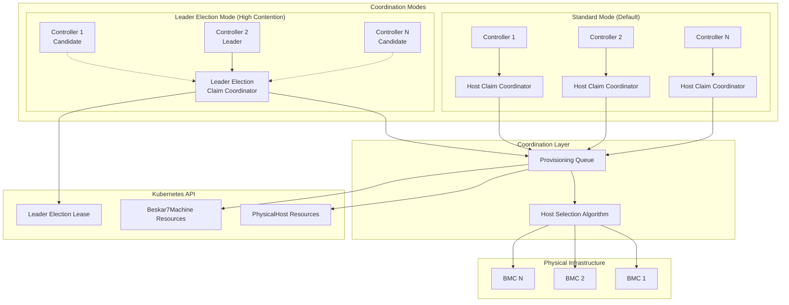
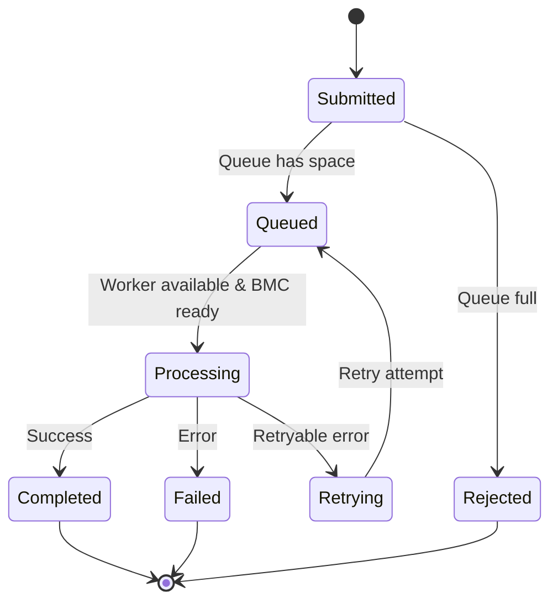

# Concurrent Provisioning System

The Beskar7 concurrent provisioning system provides robust coordination for multiple machines claiming and provisioning bare-metal hosts simultaneously. This system prevents race conditions, ensures deterministic host allocation, and manages BMC resource contention through multiple coordination strategies.

## Architecture Overview

### Components

1. **HostClaimCoordinator**: Manages atomic host claiming and conflict resolution using optimistic locking
2. **LeaderElectionClaimCoordinator**: Enhanced coordination using leader election for high-contention scenarios
3. **ProvisioningQueue**: Coordinates BMC operations to prevent overload with rate limiting
4. **Deterministic Host Selection**: Ensures consistent host allocation across restarts
5. **Optimistic Locking**: Prevents concurrent modifications using Kubernetes resource versions

### Multi-Mode Coordination Architecture



### Coordination Strategies

#### 1. Standard Optimistic Locking (Default)
- **Use Case**: Small to medium deployments with moderate concurrency
- **Mechanism**: Kubernetes resource version-based atomic updates
- **Conflict Resolution**: Exponential backoff with retry
- **Performance**: Sub-second claim operations
- **Scalability**: Up to 10-20 concurrent claims

#### 2. Leader Election Coordination (High Contention)
- **Use Case**: Large deployments with high concurrency and frequent conflicts
- **Mechanism**: Single leader processes claims with priority-based queuing
- **Conflict Resolution**: Centralized ordering prevents conflicts
- **Performance**: 1-3 second claim operations with lower conflict rate
- **Scalability**: 50+ concurrent claims with deterministic ordering

## Configuration Guide

### Standard Configuration

The system is automatically enabled with default optimistic locking:

```yaml
# Manager deployment with standard coordination
apiVersion: apps/v1
kind: Deployment
metadata:
  name: beskar7-controller-manager
spec:
  replicas: 3
  template:
    spec:
      containers:
      - name: manager
        args:
        - --leader-elect=true
        # Standard coordination is automatic
        # No additional flags needed
```

### Leader Election Coordination

Enable leader election for claim coordination in high-contention scenarios:

```yaml
# Manager deployment with leader election coordination
apiVersion: apps/v1
kind: Deployment
metadata:
  name: beskar7-controller-manager
spec:
  replicas: 5  # More replicas for high availability
  template:
    spec:
      containers:
      - name: manager
        args:
        - --leader-elect=true
        # Leader election coordination flags
        - --enable-claim-coordinator-leader-election=true
        - --claim-coordinator-lease-duration=15s
        - --claim-coordinator-renew-deadline=10s
        - --claim-coordinator-retry-period=2s
```

### Configuration Parameters

#### Leader Election Coordination

| Parameter | Default | Description | Recommendations |
|-----------|---------|-------------|-----------------|
| `--enable-claim-coordinator-leader-election` | `false` | Enable leader election coordination | Enable for >20 concurrent claims |
| `--claim-coordinator-lease-duration` | `15s` | How long leader holds the lease | 10-30s based on network stability |
| `--claim-coordinator-renew-deadline` | `10s` | Time to renew before giving up | 60-80% of lease duration |
| `--claim-coordinator-retry-period` | `2s` | Interval between acquisition attempts | 1-5s based on urgency |

#### Provisioning Queue Settings

```yaml
apiVersion: v1
kind: ConfigMap
metadata:
  name: beskar7-config
  namespace: beskar7-system
data:
  # Queue configuration
  provisioning.maxConcurrentOps: "5"      # Max concurrent BMC operations
  provisioning.maxQueueSize: "50"         # Max queued operations
  provisioning.operationTimeout: "5m"     # Individual operation timeout
  provisioning.bmcCooldownPeriod: "10s"   # Delay between BMC operations
  
  # Host selection configuration
  hostSelection.algorithm: "deterministic" # deterministic | round-robin | priority
  hostSelection.retryLimit: "3"           # Max retries for failed selections
  hostSelection.backoffMultiplier: "1.5"  # Exponential backoff multiplier
```

## Host Claiming Process

### 1. Deterministic Host Selection

The system uses a deterministic algorithm ensuring consistent host assignment:

```go
// Example: Machine "worker-1" will always prefer the same host order
selectedHost := coordinator.selectHostDeterministic(availableHosts, machine)
```

**Algorithm Steps:**
1. Sort available hosts by name (deterministic ordering)
2. Generate machine identifier hash from namespace and name  
3. Use modulo operation to select from sorted list
4. Ensure consistent selection across controller restarts
5. Handle host unavailability with deterministic fallback

**Priority Factors (Leader Election Mode):**
- **Machine Age**: Older machines get higher priority (+1 point per minute)
- **Hardware Simplicity**: Simple requirements get bonus (+50 points)
- **Retry Count**: Fewer retries get priority
- **Base Priority**: 100 points for all claims

### 2. Atomic Claiming with Optimistic Locking

```go
// Enhanced atomic claim operation with conflict detection
func (c *HostClaimCoordinator) attemptAtomicClaim(ctx context.Context, host *PhysicalHost, request ClaimRequest) (*ClaimResult, error) {
    // Get current resource version
    currentHost := host.DeepCopy()
    
    // Validate host is still available
    if currentHost.Spec.ConsumerRef != nil {
        return &ClaimResult{ClaimSuccess: false, ConflictReason: "already_claimed"}, nil
    }
    
    // Set consumer reference atomically
    currentHost.Spec.ConsumerRef = &corev1.ObjectReference{
        Kind:      request.Machine.Kind,
        Name:      request.Machine.Name,
        Namespace: request.Machine.Namespace,
        UID:       request.Machine.UID,
    }
    
    // Add claim metadata
    if currentHost.Annotations == nil {
        currentHost.Annotations = make(map[string]string)
    }
    currentHost.Annotations["beskar7.io/claimed-at"] = time.Now().Format(time.RFC3339)
    currentHost.Annotations["beskar7.io/claimed-by"] = request.Machine.Name
    
    // Atomic update with resource version check
    if err := c.Update(ctx, currentHost); err != nil {
        if apierrors.IsConflict(err) {
            // Record conflict metrics
            metrics.RecordHostClaimConflict(request.Machine.Namespace, "optimistic_lock_conflict")
            return c.retryClaimWithBackoff(ctx, host, request)
        }
        return nil, err
    }
    
    // Record successful claim
    metrics.RecordHostClaimSuccess(request.Machine.Namespace)
    return &ClaimResult{Host: currentHost, ClaimSuccess: true}, nil
}
```

### 3. Enhanced Conflict Resolution

**Standard Mode Conflicts:**
1. **Optimistic Lock Conflict**: First successful update wins
2. **Exponential Backoff**: Failed claims retry with increasing delays (1s, 2s, 4s, 8s)
3. **Alternative Selection**: Selects next available host in deterministic order
4. **Retry Limits**: Maximum 5 retry attempts before failure
5. **Conflict Metrics**: Detailed metrics on conflict causes and resolution

**Leader Election Mode Conflicts:**
1. **Priority Queuing**: Claims processed in priority order by leader
2. **Conflict Prevention**: Centralized processing eliminates race conditions
3. **Fallback Coordination**: Non-leaders use optimistic locking as fallback
4. **Leadership Transitions**: Graceful handling of leader changes

## Provisioning Queue Management

### Queue Operations and Lifecycle



### BMC Resource Coordination

Advanced BMC management prevents overload and ensures reliability:

#### 1. Concurrent Operation Limits
- **Global Limit**: Maximum concurrent operations cluster-wide
- **Per-BMC Limit**: Maximum operations per individual BMC
- **Dynamic Scaling**: Automatic adjustment based on BMC performance

#### 2. Intelligent Cooldown Management
```go
// BMC-specific cooldown periods
bmcCooldownPeriods := map[string]time.Duration{
    "dell-idrac":    10 * time.Second,  // Dell iDRAC
    "hpe-ilo":       8 * time.Second,   // HPE iLO  
    "lenovo-xcc":    12 * time.Second,  // Lenovo XCC
    "supermicro":    15 * time.Second,  // Supermicro BMC
}
```

#### 3. Operation Priority and Queuing
- **High Priority**: Claim operations (immediate provisioning needs)
- **Medium Priority**: Provision operations (scheduled provisioning)
- **Low Priority**: Deprovision operations (cleanup activities)
- **Maintenance Priority**: Health checks and status updates

### Queue Configuration Examples

#### High Throughput Configuration
```yaml
apiVersion: v1
kind: ConfigMap
metadata:
  name: beskar7-config
data:
  provisioning.maxConcurrentOps: "15"     # Higher concurrency
  provisioning.maxQueueSize: "100"        # Larger queue
  provisioning.operationTimeout: "3m"     # Shorter timeout
  provisioning.bmcCooldownPeriod: "5s"    # Reduced cooldown
  provisioning.workerCount: "10"          # More workers
```

#### Conservative Configuration
```yaml
apiVersion: v1
kind: ConfigMap
metadata:
  name: beskar7-config
data:
  provisioning.maxConcurrentOps: "3"      # Limited concurrency
  provisioning.maxQueueSize: "25"         # Smaller queue
  provisioning.operationTimeout: "10m"    # Longer timeout
  provisioning.bmcCooldownPeriod: "30s"   # Extended cooldown
  provisioning.retryAttempts: "5"         # More retries
```

## Monitoring and Observability

### Comprehensive Metrics

#### Host Claim Metrics
| Metric | Description | Labels | Alerting Threshold |
|--------|-------------|--------|-------------------|
| `beskar7_host_claim_attempts_total` | Total claim attempts | `namespace`, `outcome`, `conflict_reason` | Conflict rate >10% |
| `beskar7_host_claim_duration_seconds` | Time to complete claims | `namespace`, `outcome` | P95 >5s |
| `beskar7_host_claim_retries_total` | Claim retry attempts | `namespace`, `retry_reason` | Retry rate >20% |
| `beskar7_host_claim_queue_length` | Pending claim requests | `namespace` | Queue >80% full |

#### Leader Election Metrics
| Metric | Description | Labels | Alerting Threshold |
|--------|-------------|--------|-------------------|
| `beskar7_claim_coordinator_leader_election_total` | Leadership transitions | `namespace`, `event_type` | Frequent transitions |
| `beskar7_claim_coordinator_leadership_duration_seconds` | Time as leader | `namespace` | Very short durations |
| `beskar7_claim_coordinator_processing_duration_seconds` | Claim processing time | `namespace`, `priority` | P95 >3s |
| `beskar7_claim_coordinator_queue_length` | Leader coordination queue | `namespace` | Queue >40 items |

#### Provisioning Queue Metrics
| Metric | Description | Labels | Alerting Threshold |
|--------|-------------|--------|-------------------|
| `beskar7_provisioning_queue_length` | Current queue length | `namespace` | >80% of max |
| `beskar7_provisioning_queue_processing_count` | Operations in progress | `namespace` | At max concurrency |
| `beskar7_bmc_cooldown_waits_total` | BMC cooldown events | `namespace`, `bmc_address` | Frequent cooldowns |
| `beskar7_bmc_operation_duration_seconds` | BMC operation times | `namespace`, `bmc_type`, `operation` | P95 >30s |

### Enhanced Alerting Rules

```yaml
groups:
- name: beskar7-concurrent-provisioning
  rules:
  # High-level health alerts
  - alert: ConcurrentProvisioningDegraded
    expr: |
      (
        rate(beskar7_host_claim_attempts_total{outcome="conflict"}[5m]) /
        rate(beskar7_host_claim_attempts_total[5m])
      ) > 0.15
    for: 3m
    labels:
      severity: warning
    annotations:
      summary: High claim conflict rate
      description: "{{ $value | humanizePercentage }} of host claims are conflicting in {{ $labels.namespace }}"
      runbook_url: "https://docs.beskar7.io/runbooks/claim-conflicts"
      
  - alert: ProvisioningQueueBacklog
    expr: beskar7_provisioning_queue_length / 50 > 0.9
    for: 2m
    labels:
      severity: critical
    annotations:
      summary: Provisioning queue nearly full
      description: "Queue {{ $value | humanizePercentage }} full, may reject new requests"
      runbook_url: "https://docs.beskar7.io/runbooks/queue-backlog"
      
  # Performance degradation alerts  
  - alert: SlowHostClaiming
    expr: histogram_quantile(0.95, beskar7_host_claim_duration_seconds) > 5
    for: 5m
    labels:
      severity: warning
    annotations:
      summary: Host claiming taking too long
      description: "95th percentile claim time is {{ $value }}s"
      
  # Infrastructure health alerts
  - alert: BMCOverload
    expr: rate(beskar7_bmc_cooldown_waits_total[5m]) > 0.5
    for: 3m
    labels:
      severity: warning
    annotations:
      summary: BMC operations being throttled
      description: "BMC {{ $labels.bmc_address }} experiencing high load"
      
  # Leader election alerts
  - alert: FrequentLeadershipChanges
    expr: rate(beskar7_claim_coordinator_leader_election_total[10m]) > 0.1
    for: 5m
    labels:
      severity: warning
    annotations:
      summary: Frequent leader election changes
      description: "Leadership changing {{ $value }} times per minute"

  # Queue stall detection
  - alert: ProvisioningQueueStalled
    expr: |
      (
        beskar7_provisioning_queue_length > 0 and
        rate(beskar7_provisioning_queue_processing_count[5m]) == 0
      )
    for: 5m
    labels:
      severity: critical
    annotations:
      summary: Provisioning queue appears stalled
      description: "Queue has {{ $value }} items but no processing activity"
```

### Grafana Dashboard Queries

#### Claim Success Rate Panel
```promql
# Claim success rate over time
sum(rate(beskar7_host_claim_attempts_total{outcome="success"}[5m])) /
sum(rate(beskar7_host_claim_attempts_total[5m])) * 100
```

#### Conflict Analysis Panel
```promql
# Breakdown of conflict reasons
sum by (conflict_reason) (
  rate(beskar7_host_claim_attempts_total{outcome="conflict"}[5m])
)
```

#### Queue Health Panel
```promql
# Queue utilization percentage
beskar7_provisioning_queue_length / 50 * 100
```

#### BMC Performance Panel
```promql
# BMC operation latency by vendor
histogram_quantile(0.95, 
  sum by (bmc_type, le) (
    rate(beskar7_bmc_operation_duration_seconds_bucket[5m])
  )
)
```

## Troubleshooting Guide

### Diagnostic Commands

#### Quick Health Check
```bash
#!/bin/bash
# Quick concurrent provisioning health check

echo "=== Beskar7 Concurrent Provisioning Health Check ==="

# Check controller status
echo "Controller Status:"
kubectl get deployment beskar7-controller-manager -n beskar7-system

# Check leader election
echo "Leader Election Status:"
kubectl get lease -n beskar7-system | grep beskar7

# Check recent events
echo "Recent Events:"
kubectl get events -n beskar7-system --sort-by='.lastTimestamp' | tail -10

# Check host claim metrics
echo "Host Claim Metrics (last 5m):"
kubectl get --raw /metrics | grep beskar7_host_claim_attempts_total | tail -5

# Check provisioning queue status
echo "Provisioning Queue Status:"
kubectl get --raw /metrics | grep beskar7_provisioning_queue_length
```

#### Detailed Diagnostics
```bash
#!/bin/bash
# Comprehensive concurrent provisioning diagnostics

echo "=== Detailed Concurrent Provisioning Diagnostics ==="

# Controller configuration
echo "Controller Configuration:"
kubectl describe deployment beskar7-controller-manager -n beskar7-system | grep -A 20 "Args:"

# Resource utilization
echo "Resource Utilization:"
kubectl top pod -n beskar7-system

# Host states
echo "Host States:"
kubectl get physicalhosts -o custom-columns=NAME:.metadata.name,STATE:.status.state,CONSUMER:.spec.consumerRef.name

# Detailed logs from last hour
echo "Recent Errors:"
kubectl logs -n beskar7-system deployment/beskar7-controller-manager --since=1h | grep -i error | tail -10

# Claim conflicts
echo "Recent Claim Conflicts:"
kubectl get events --field-selector reason=ClaimConflict --sort-by='.lastTimestamp' | tail -10
```

### Common Issues and Solutions

#### Issue 1: High Claim Conflict Rate

**Symptoms:**
- `beskar7_host_claim_attempts_total{outcome="conflict"}` rate >10%
- Frequent "optimistic lock conflict" errors in logs
- Machines taking long time to get provisioned

**Root Causes:**
1. **Insufficient host pool**: Too few hosts for concurrent demand
2. **Deterministic selection conflicts**: Multiple machines preferring same hosts
3. **Resource version staleness**: Controllers using outdated host information

**Solutions:**

*Short-term:*
```bash
# Increase host pool
kubectl scale deployment worker-machine-deployment --replicas=+5

# Enable leader election coordination
kubectl patch deployment beskar7-controller-manager -n beskar7-system \
  --patch '{"spec":{"template":{"spec":{"containers":[{"name":"manager","args":["--enable-claim-coordinator-leader-election=true"]}]}}}}'
```

*Long-term:*
```yaml
# Add more diverse hosts with different characteristics
apiVersion: infrastructure.cluster.x-k8s.io/v1beta1
kind: PhysicalHost
metadata:
  name: host-varied-tags-01
spec:
  tags: ["worker", "gpu", "high-memory"]  # More specific tagging
  redfishConnection:
    address: "redfish-diverse.example.com"
```

#### Issue 2: Provisioning Queue Backlog

**Symptoms:**
- `beskar7_provisioning_queue_length` approaching maximum
- New operations being rejected
- BMC cooldown waits increasing

**Root Causes:**
1. **BMC overload**: Too many concurrent operations per BMC
2. **Slow BMC responses**: Individual BMCs taking too long
3. **Network issues**: Connectivity problems to BMCs

**Solutions:**

*Immediate:*
```bash
# Increase queue capacity
kubectl patch configmap beskar7-config -n beskar7-system \
  --patch '{"data":{"provisioning.maxQueueSize":"100"}}'

# Add more workers
kubectl patch configmap beskar7-config -n beskar7-system \
  --patch '{"data":{"provisioning.workerCount":"8"}}'
```

*Investigation:*
```bash
# Check BMC response times
kubectl get --raw /metrics | grep beskar7_bmc_operation_duration

# Identify slow BMCs
kubectl logs -n beskar7-system deployment/beskar7-controller-manager | grep "BMC operation timeout"

# Check network connectivity
kubectl exec -n beskar7-system deployment/beskar7-controller-manager -- nslookup your-bmc.example.com
```

#### Issue 3: Leader Election Instability

**Symptoms:**
- Frequent leadership changes
- `beskar7_claim_coordinator_leader_election_total` rate high
- Inconsistent claim processing performance

**Root Causes:**
1. **Network partitions**: Controllers losing connectivity
2. **Resource constraints**: Leader pods being killed or restarted
3. **Timing configuration**: Lease parameters too aggressive

**Solutions:**

*Configuration adjustments:*
```yaml
# More conservative leader election settings
apiVersion: apps/v1
kind: Deployment
metadata:
  name: beskar7-controller-manager
spec:
  template:
    spec:
      containers:
      - name: manager
        args:
        - --claim-coordinator-lease-duration=30s    # Longer lease
        - --claim-coordinator-renew-deadline=20s    # More renewal time
        - --claim-coordinator-retry-period=5s       # Less aggressive retries
```

*Resource improvements:*
```yaml
# Increase controller resources
spec:
  template:
    spec:
      containers:
      - name: manager
        resources:
          requests:
            memory: "256Mi"
            cpu: "200m"
          limits:
            memory: "1Gi"
            cpu: "500m"
```

#### Issue 4: BMC Performance Degradation

**Symptoms:**
- `beskar7_bmc_operation_duration_seconds` P95 >30s
- Frequent BMC cooldown waits
- Provisioning operations timing out

**Root Causes:**
1. **BMC firmware issues**: Outdated or buggy firmware
2. **Network latency**: High latency to BMC management network
3. **BMC overload**: Too many concurrent operations

**Solutions:**

*Immediate mitigation:*
```yaml
# Increase BMC cooldown periods
apiVersion: v1
kind: ConfigMap
metadata:
  name: beskar7-config
data:
  provisioning.bmcCooldownPeriod: "30s"     # Longer cooldown
  provisioning.operationTimeout: "10m"       # More timeout
  provisioning.maxConcurrentOps: "3"         # Reduce concurrency
```

*Long-term fixes:*
```bash
# Check BMC firmware versions
curl -k https://your-bmc.example.com/redfish/v1/UpdateService/FirmwareInventory

# Test network latency
ping -c 10 your-bmc.example.com

# Monitor BMC performance
kubectl get --raw /metrics | grep beskar7_bmc_operation_duration_seconds
```

#### Issue 5: Controller Resource Exhaustion

**Symptoms:**
- Controllers being OOMKilled
- High CPU usage on controller pods
- Delayed reconciliation loops

**Root Causes:**
1. **Memory leaks**: Accumulating resources not being cleaned up
2. **High concurrency**: Too many concurrent reconciles
3. **Large object sizes**: Working with large host inventories

**Solutions:**

*Resource scaling:*
```yaml
# Increase controller resources
spec:
  template:
    spec:
      containers:
      - name: manager
        resources:
          requests:
            memory: "512Mi"
            cpu: "300m"
          limits:
            memory: "2Gi"
            cpu: "1000m"
```

*Concurrency tuning:*
```yaml
# Reduce concurrent reconciles
spec:
  template:
    spec:
      containers:
      - name: manager
        args:
        - --max-concurrent-reconciles=5  # Reduce from default 10
```

### Debugging Workflows

#### Claim Conflict Investigation

1. **Identify conflicting machines:**
```bash
kubectl get events --field-selector reason=ClaimConflict -o jsonpath='{.items[*].involvedObject.name}'
```

2. **Check host selection pattern:**
```bash
kubectl logs -n beskar7-system deployment/beskar7-controller-manager | grep "selecting host" | tail -20
```

3. **Analyze deterministic selection:**
```bash
# Look for machines preferring same hosts
kubectl logs -n beskar7-system deployment/beskar7-controller-manager | grep "deterministic host selection" | sort
```

4. **Verify host pool adequacy:**
```bash
# Compare available hosts vs pending machines
AVAILABLE_HOSTS=$(kubectl get physicalhosts -o jsonpath='{.items[?(@.status.state=="Available")].metadata.name}' | wc -w)
PENDING_MACHINES=$(kubectl get beskar7machines -o jsonpath='{.items[?(@.status.phase!="Provisioned")].metadata.name}' | wc -w)
echo "Available hosts: $AVAILABLE_HOSTS, Pending machines: $PENDING_MACHINES"
```

#### Performance Analysis Workflow

1. **Baseline metrics collection:**
```bash
# Collect 5-minute baseline
kubectl get --raw /metrics | grep beskar7_ > baseline_metrics.txt
sleep 300
kubectl get --raw /metrics | grep beskar7_ > current_metrics.txt
```

2. **Identify bottlenecks:**
```bash
# Check queue lengths
grep beskar7_provisioning_queue_length current_metrics.txt

# Check claim durations
grep beskar7_host_claim_duration current_metrics.txt

# Check BMC performance
grep beskar7_bmc_operation_duration current_metrics.txt
```

3. **Trace specific operations:**
```bash
# Follow a specific machine through the process
MACHINE_NAME="worker-01"
kubectl logs -n beskar7-system deployment/beskar7-controller-manager | grep "$MACHINE_NAME" | sort -k1,2
```

## Performance Optimization

### Scaling Guidelines

#### Small Deployments (1-20 hosts)
```yaml
# Recommended configuration for small deployments
spec:
  replicas: 1  # Single controller sufficient
  template:
    spec:
      containers:
      - name: manager
        args:
        - --leader-elect=false  # Can disable leader election
        - --max-concurrent-reconciles=5
        resources:
          requests:
            memory: "128Mi"
            cpu: "100m"
          limits:
            memory: "512Mi"
            cpu: "300m"
---
apiVersion: v1
kind: ConfigMap
metadata:
  name: beskar7-config
data:
  provisioning.maxConcurrentOps: "3"
  provisioning.maxQueueSize: "20"
```

#### Medium Deployments (20-100 hosts)
```yaml
# Recommended configuration for medium deployments
spec:
  replicas: 3  # HA with reasonable redundancy
  template:
    spec:
      containers:
      - name: manager
        args:
        - --leader-elect=true
        - --max-concurrent-reconciles=10
        resources:
          requests:
            memory: "256Mi"
            cpu: "200m"
          limits:
            memory: "1Gi"
            cpu: "500m"
---
apiVersion: v1
kind: ConfigMap
metadata:
  name: beskar7-config
data:
  provisioning.maxConcurrentOps: "8"
  provisioning.maxQueueSize: "50"
  provisioning.bmcCooldownPeriod: "8s"
```

#### Large Deployments (100+ hosts)
```yaml
# Recommended configuration for large deployments
spec:
  replicas: 5  # High availability
  template:
    spec:
      containers:
      - name: manager
        args:
        - --leader-elect=true
        - --enable-claim-coordinator-leader-election=true  # Enable advanced coordination
        - --max-concurrent-reconciles=15
        resources:
          requests:
            memory: "512Mi"
            cpu: "300m"
          limits:
            memory: "2Gi"
            cpu: "1000m"
---
apiVersion: v1
kind: ConfigMap
metadata:
  name: beskar7-config
data:
  provisioning.maxConcurrentOps: "15"
  provisioning.maxQueueSize: "100"
  provisioning.workerCount: "10"
  provisioning.bmcCooldownPeriod: "5s"
```

### Performance Tuning Tips

#### 1. Host Pool Management
- **20% Buffer Rule**: Maintain 20% more hosts than peak concurrent demand
- **Diverse Tagging**: Use varied host tags to reduce selection conflicts
- **Failure Domain Distribution**: Spread hosts across racks/zones
- **Regular Cleanup**: Remove failed/decommissioned hosts promptly

#### 2. Network Optimization
- **Dedicated Management Network**: Use separate network for BMC traffic
- **DNS Caching**: Configure DNS caching for BMC hostname resolution
- **Connection Pooling**: Enable HTTP connection pooling for Redfish clients
- **Timeout Tuning**: Adjust timeouts based on network characteristics

#### 3. Resource Management
- **Right-sized Controllers**: Match controller resources to workload
- **Quality of Service**: Use appropriate QoS classes for controller pods
- **Node Affinity**: Place controllers on stable, high-performance nodes
- **Pod Disruption Budgets**: Prevent simultaneous controller disruptions

### Capacity Planning

#### Calculation Formulas

**Host Pool Size:**
```
Required Hosts = Peak Concurrent Machines × 1.2 (buffer) + Failed Host Reserve
```

**Controller Resources:**
```
Memory = (Number of Hosts × 2MB) + (Concurrent Reconciles × 10MB) + 128MB (base)
CPU = (Concurrent Reconciles × 20m) + (Active Claims/sec × 5m) + 100m (base)
```

**Queue Configuration:**
```
Max Queue Size = Peak Hourly Provisioning × 1.5
Max Concurrent Ops = min(BMC Vendor Limit, Network Bandwidth / Average Op Size)
```

#### Example Capacity Planning

For a 200-host cluster with 50 peak concurrent provisions:

```yaml
# Calculated configuration
spec:
  replicas: 3
  template:
    spec:
      containers:
      - name: manager
        resources:
          requests:
            memory: "640Mi"  # (200×2MB + 15×10MB + 128MB)
            cpu: "500m"      # (15×20m + 50×5m + 100m)
          limits:
            memory: "1.5Gi"
            cpu: "1000m"
---
apiVersion: v1
kind: ConfigMap
metadata:
  name: beskar7-config
data:
  provisioning.maxConcurrentOps: "12"  # Based on BMC vendor limits
  provisioning.maxQueueSize: "75"      # 50 × 1.5
```

## Best Practices

### Production Deployment

#### 1. High Availability Setup
```yaml
# Production HA deployment
apiVersion: apps/v1
kind: Deployment
metadata:
  name: beskar7-controller-manager
spec:
  replicas: 3
  strategy:
    type: RollingUpdate
    rollingUpdate:
      maxUnavailable: 1
      maxSurge: 1
  template:
    spec:
      affinity:
        podAntiAffinity:
          preferredDuringSchedulingIgnoredDuringExecution:
          - weight: 100
            podAffinityTerm:
              labelSelector:
                matchLabels:
                  app: beskar7-controller-manager
              topologyKey: kubernetes.io/hostname
      containers:
      - name: manager
        args:
        - --leader-elect=true
        - --enable-claim-coordinator-leader-election=true
```

#### 2. Monitoring and Alerting
```yaml
# ServiceMonitor for Prometheus scraping
apiVersion: monitoring.coreos.com/v1
kind: ServiceMonitor
metadata:
  name: beskar7-controller-manager
spec:
  selector:
    matchLabels:
      app: beskar7-controller-manager
  endpoints:
  - port: metrics
    interval: 30s
    path: /metrics
```

#### 3. Security Hardening
```yaml
# Security-hardened deployment
spec:
  template:
    spec:
      securityContext:
        runAsNonRoot: true
        runAsUser: 1000
        fsGroup: 2000
      containers:
      - name: manager
        securityContext:
          allowPrivilegeEscalation: false
          capabilities:
            drop:
            - ALL
          readOnlyRootFilesystem: true
        volumeMounts:
        - name: tmp
          mountPath: /tmp
        - name: cache
          mountPath: /root/.cache
      volumes:
      - name: tmp
        emptyDir: {}
      - name: cache
        emptyDir: {}
```

### Operational Excellence

#### 1. Regular Maintenance
```bash
#!/bin/bash
# Weekly maintenance script

# Check for stale host claims (older than 24h)
kubectl get physicalhosts -o jsonpath='{.items[?(@.metadata.annotations.beskar7\.io/claimed-at)].metadata.name}' | \
xargs -I {} sh -c 'CLAIMED_TIME=$(kubectl get physicalhost {} -o jsonpath="{.metadata.annotations.beskar7\.io/claimed-at}"); if [[ $(date -d "$CLAIMED_TIME" +%s) -lt $(date -d "24 hours ago" +%s) ]]; then echo "Stale claim: {}"; fi'

# Clean up failed provisioning requests
kubectl get events --field-selector reason=ProvisioningFailed --sort-by='.lastTimestamp' | tail -10

# Check metrics for anomalies
kubectl get --raw /metrics | grep beskar7_host_claim_attempts_total | awk '{print $2}' | sort -n | tail -5
```

#### 2. Change Management
- **Staged Rollouts**: Deploy configuration changes to staging first
- **Feature Flags**: Use environment variables for feature toggles
- **Rollback Plans**: Maintain rollback procedures for configuration changes
- **Testing**: Validate changes with synthetic workloads

#### 3. Disaster Recovery
- **Backup Strategy**: Regular backups of PhysicalHost and configuration resources
- **Recovery Procedures**: Documented steps for cluster reconstruction
- **Cross-Region**: Consider multi-region deployments for critical workloads

## Security Considerations

### Access Control and RBAC

#### Minimal RBAC Permissions
```yaml
# Production RBAC with minimal permissions
apiVersion: rbac.authorization.k8s.io/v1
kind: ClusterRole
metadata:
  name: beskar7-controller-manager
rules:
# Core resource management
- apiGroups: ["infrastructure.cluster.x-k8s.io"]
  resources: ["physicalhosts", "beskar7machines", "beskar7clusters"]
  verbs: ["get", "list", "watch", "create", "update", "patch"]
# Status updates only
- apiGroups: ["infrastructure.cluster.x-k8s.io"]
  resources: ["physicalhosts/status", "beskar7machines/status"]
  verbs: ["get", "update", "patch"]
# Leader election coordination
- apiGroups: ["coordination.k8s.io"]
  resources: ["leases"]
  verbs: ["get", "create", "update", "patch"]
  resourceNames: ["beskar7-controller-manager", "beskar7-claim-coordinator-leader"]
# Events for observability
- apiGroups: [""]
  resources: ["events"]
  verbs: ["create", "patch"]
```

#### Network Security
```yaml
# Network policies for controller isolation
apiVersion: networking.k8s.io/v1
kind: NetworkPolicy
metadata:
  name: beskar7-controller-network-policy
spec:
  podSelector:
    matchLabels:
      app: beskar7-controller-manager
  policyTypes:
  - Ingress
  - Egress
  ingress:
  - from:
    - podSelector:
        matchLabels:
          app: monitoring-system
    ports:
    - protocol: TCP
      port: 8080  # Metrics port
  egress:
  - to: []
    ports:
    - protocol: TCP
      port: 443   # HTTPS to BMCs
    - protocol: TCP
      port: 6443  # Kubernetes API
  - to:
    - namespaceSelector:
        matchLabels:
          name: kube-system
    ports:
    - protocol: TCP
      port: 53    # DNS
    - protocol: UDP
      port: 53    # DNS
```

### Credential Management

#### BMC Credential Security
```yaml
# Secure credential storage
apiVersion: v1
kind: Secret
metadata:
  name: bmc-credentials
  namespace: beskar7-system
type: Opaque
data:
  username: YWRtaW4=  # base64 encoded
  password: cGFzc3dvcmQ=  # base64 encoded
---
apiVersion: infrastructure.cluster.x-k8s.io/v1beta1
kind: PhysicalHost
metadata:
  name: secure-host
spec:
  redfishConnection:
    address: "redfish.secure.example.com"
    credentialsSecretRef: "bmc-credentials"
    # Use TLS for all BMC communications
    insecure: false
```

### Audit and Compliance

#### Audit Logging
```yaml
# Enhanced audit policy for Beskar7 operations
apiVersion: audit.k8s.io/v1
kind: Policy
rules:
# Capture all mutations to Beskar7 resources
- level: Request
  namespaces: ["beskar7-system"]
  resources:
  - group: "infrastructure.cluster.x-k8s.io"
    resources: ["physicalhosts", "beskar7machines"]
  verbs: ["create", "update", "patch", "delete"]
# Capture leader election events
- level: Metadata
  resources:
  - group: "coordination.k8s.io"
    resources: ["leases"]
    resourceNames: ["beskar7-controller-manager", "beskar7-claim-coordinator-leader"]
```

## Migration and Upgrade Guide

### Upgrading Coordination Modes

#### From Standard to Leader Election
1. **Pre-upgrade Assessment:**
```bash
# Check current conflict rate
kubectl get --raw /metrics | grep beskar7_host_claim_attempts_total

# Assess workload
PENDING_MACHINES=$(kubectl get beskar7machines -o jsonpath='{.items[?(@.status.phase!="Provisioned")].metadata.name}' | wc -w)
echo "Pending machines: $PENDING_MACHINES"
```

2. **Staged Migration:**
```yaml
# Phase 1: Enable leader election on subset of controllers
apiVersion: apps/v1
kind: Deployment
metadata:
  name: beskar7-controller-manager
spec:
  replicas: 3
  template:
    spec:
      containers:
      - name: manager
        env:
        - name: ENABLE_LEADER_ELECTION_MIGRATION
          value: "true"  # Feature flag
        args:
        - --enable-claim-coordinator-leader-election=true
```

3. **Validation and Rollout:**
```bash
# Monitor leader election stability
kubectl get lease -n beskar7-system beskar7-claim-coordinator-leader -w

# Check for improved conflict rates
watch "kubectl get --raw /metrics | grep beskar7_host_claim_attempts_total"

# Complete rollout once stable
kubectl patch deployment beskar7-controller-manager -p '{"spec":{"replicas":5}}'
```

### Version Compatibility

#### Backward Compatibility Matrix
| Feature | v1.0 | v1.1 | v1.2 | Migration Required |
|---------|------|------|------|-------------------|
| Standard Coordination | ✅ | ✅ | ✅ | No |
| Leader Election | ❌ | ✅ | ✅ | Configuration only |
| Enhanced Metrics | ❌ | ❌ | ✅ | Monitoring update |
| Priority Queuing | ❌ | ❌ | ✅ | No |

### Rollback Procedures

#### Emergency Rollback
```bash
#!/bin/bash
# Emergency rollback to standard coordination

# Disable leader election immediately
kubectl patch deployment beskar7-controller-manager -n beskar7-system \
  --patch '{"spec":{"template":{"spec":{"containers":[{"name":"manager","args":["--enable-claim-coordinator-leader-election=false"]}]}}}}'

# Clean up leader election lease
kubectl delete lease beskar7-claim-coordinator-leader -n beskar7-system

# Restart all controller pods
kubectl rollout restart deployment/beskar7-controller-manager -n beskar7-system

# Monitor rollback success
kubectl rollout status deployment/beskar7-controller-manager -n beskar7-system
```

## Future Enhancements

### Planned Features

#### 1. Advanced Hardware Requirements Matching
```yaml
# Future hardware requirements specification
apiVersion: infrastructure.cluster.x-k8s.io/v1beta2
kind: Beskar7Machine
spec:
  hardwareRequirements:
    cpu:
      cores: 16
      architecture: "x86_64"
    memory:
      capacity: "64Gi"
      type: "DDR4"
    storage:
      type: "NVMe"
      capacity: "1Ti"
    network:
      interfaces: 2
      speed: "10Gbps"
    gpu:
      count: 1
      type: "NVIDIA Tesla V100"
```

#### 2. Cross-Cluster Host Sharing
```yaml
# Multi-cluster coordination
apiVersion: infrastructure.cluster.x-k8s.io/v1beta2
kind: HostPool
metadata:
  name: shared-worker-pool
spec:
  clusters:
  - name: "production-east"
    priority: 1
  - name: "production-west"
    priority: 2
  sharedHosts:
  - selector:
      matchLabels:
        tier: "worker"
        shared: "true"
```

#### 3. Intelligent Resource Scheduling
```yaml
# AI-powered host selection
apiVersion: v1
kind: ConfigMap
metadata:
  name: beskar7-config
data:
  hostSelection.algorithm: "ml-enhanced"
  hostSelection.modelEndpoint: "http://ml-service:8080/predict"
  hostSelection.features: "workload-history,hardware-utilization,failure-rates"
```

### Integration Roadmap

#### Q1 2024: Enhanced Observability
- Grafana dashboard templates
- Enhanced Prometheus metrics
- Distributed tracing support
- Performance profiling tools

#### Q2 2024: Advanced Coordination
- Distributed queue coordination
- Cross-region leader election
- Advanced priority algorithms
- Custom selection strategies

#### Q3 2024: AI/ML Integration
- Predictive host selection
- Failure prediction models
- Workload-based optimization
- Automated tuning recommendations

#### Q4 2024: Enterprise Features
- Multi-tenancy support
- Advanced RBAC integration
- Compliance reporting
- Enhanced security features

## Conclusion

The Beskar7 concurrent provisioning system provides a robust, scalable solution for managing bare-metal infrastructure at scale. With support for multiple coordination strategies, comprehensive monitoring, and extensive troubleshooting capabilities, it enables reliable operation in diverse environments.

For additional support and community resources:
- **Documentation**: [https://docs.beskar7.io](https://docs.beskar7.io)
- **GitHub Issues**: [https://github.com/wrkode/beskar7/issues](https://github.com/wrkode/beskar7/issues)
- **Community Slack**: [#beskar7-support](https://kubernetes.slack.com/channels/beskar7-support)
- **Security Reports**: [security@beskar7.io](mailto:security@beskar7.io) 