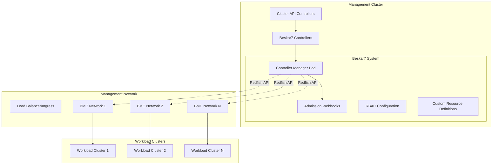

# Deployment Best Practices

This document provides guidance for deploying Beskar7 in production environments, covering security, networking, scalability, and operational considerations.

## Production Deployment Overview

Beskar7 should be deployed following cloud-native best practices with proper security, monitoring, and operational considerations.

### Deployment Architecture



## Pre-Deployment Planning

### 1. Network Architecture

**BMC Network Design:**
- Dedicated network segment for BMC traffic
- Proper VLAN isolation from production workloads
- Firewall rules limiting BMC access to management cluster
- DNS resolution for BMC hostnames (recommended)

**Network Requirements:**
```
Management Cluster → BMC Network: HTTPS (443), SSH (22)
BMCs → Image Repository: HTTP/HTTPS (80/443)
BMCs → Configuration Server: HTTP/HTTPS (80/443)
```

**Recommended Network Topology:**
```
┌─────────────────┐    ┌─────────────────┐    ┌─────────────────┐
│ Management      │    │ BMC Network     │    │ Workload        │
│ Cluster Network │    │ (Isolated)      │    │ Networks        │
│                 │    │                 │    │                 │
│ 10.0.1.0/24     │    │ 10.0.100.0/24   │    │ 10.0.2.0/24     │
└─────────────────┘    └─────────────────┘    └─────────────────┘
         │                       │                       │
         └───────────────────────┼───────────────────────┘
                                 │
                     ┌─────────────────┐
                     │ Core Network    │
                     │ Infrastructure  │
                     └─────────────────┘
```

### 2. Resource Planning

**Controller Manager Resource Requirements:**

See the comprehensive [Resource Planning Guide](resource-planning.md) for detailed sizing recommendations.

| Deployment Size | CPU Request | Memory Request | CPU Limit | Memory Limit | Replicas |
|----------------|-------------|----------------|-----------|--------------|----------|
| Small (< 50 hosts) | 100m | 128Mi | 500m | 512Mi | 1 |
| Medium (50-200 hosts) | 200m | 256Mi | 1000m | 1Gi | 2 |
| Large (200-500 hosts) | 500m | 512Mi | 2000m | 2Gi | 3 |
| Extra Large (500+ hosts) | 1000m | 1Gi | 4000m | 4Gi | 3+ |

**Storage Requirements:**
- Minimal persistent storage needed (controller is stateless)
- Consider persistent volumes for logs in production
- Certificate storage handled by cert-manager

### 3. Security Planning

**RBAC Strategy:**
- Principle of least privilege
- Separate service accounts for different components
- Namespace isolation for different teams/environments

**Network Security:**
- BMC network isolation
- TLS encryption for all communications
- Certificate management via cert-manager
- Firewall rules restricting BMC access

**Credential Management:**
- Kubernetes Secrets for BMC credentials
- Consider external secret management (Vault, etc.)
- Regular credential rotation
- Audit logging for credential access

## Production Installation

### 1. Prerequisites Setup

**Install cert-manager:**
```bash
# Install cert-manager CRDs
kubectl apply -f https://github.com/cert-manager/cert-manager/releases/download/v1.12.0/cert-manager.crds.yaml

# Install cert-manager
kubectl apply -f https://github.com/cert-manager/cert-manager/releases/download/v1.12.0/cert-manager.yaml

# Verify installation
kubectl get pods -n cert-manager
```

**Install Cluster API:**
```bash
# Install clusterctl
curl -L https://github.com/kubernetes-sigs/cluster-api/releases/download/v1.4.0/clusterctl-linux-amd64 -o clusterctl
chmod +x clusterctl
sudo mv clusterctl /usr/local/bin/

# Initialize Cluster API
clusterctl init
```

### 2. Namespace and RBAC Setup

**Create namespace:**
```bash
kubectl create namespace beskar7-system
```

**Configure RBAC (production):**
```yaml
# config/rbac/role.yaml - Minimal permissions
apiVersion: rbac.authorization.k8s.io/v1
kind: ClusterRole
metadata:
  name: beskar7-manager-role
rules:
# Physical Host management
- apiGroups: ["infrastructure.cluster.x-k8s.io"]
  resources: ["physicalhosts"]
  verbs: ["get", "list", "watch", "create", "update", "patch", "delete"]
- apiGroups: ["infrastructure.cluster.x-k8s.io"]
  resources: ["physicalhosts/status"]
  verbs: ["get", "update", "patch"]
# Beskar7Machine management
- apiGroups: ["infrastructure.cluster.x-k8s.io"]
  resources: ["beskar7machines"]
  verbs: ["get", "list", "watch", "create", "update", "patch", "delete"]
- apiGroups: ["infrastructure.cluster.x-k8s.io"]
  resources: ["beskar7machines/status"]
  verbs: ["get", "update", "patch"]
# Secret access for credentials
- apiGroups: [""]
  resources: ["secrets"]
  verbs: ["get", "list", "watch"]
# Events for status reporting
- apiGroups: [""]
  resources: ["events"]
  verbs: ["create", "patch"]
```

### 3. Configuration Management

**Production Values (Helm):**
```yaml
# values-production.yaml
replicaCount: 3

image:
  repository: ghcr.io/wrkode/beskar7/beskar7
  tag: "v0.2.6"
  pullPolicy: IfNotPresent

resources:
  limits:
    cpu: 2000m
    memory: 2Gi
  requests:
    cpu: 500m
    memory: 512Mi

# Enable leader election for HA
leaderElection:
  enabled: true
  leaseDuration: 15s
  renewDeadline: 10s
  retryPeriod: 2s

# Security context
securityContext:
  runAsNonRoot: true
  runAsUser: 65532
  seccompProfile:
    type: RuntimeDefault
  capabilities:
    drop:
    - ALL

# Pod security context
podSecurityContext:
  fsGroup: 65532

# Network policies
networkPolicy:
  enabled: true
  ingress:
    - from:
      - namespaceSelector:
          matchLabels:
            name: cert-manager
      ports:
      - protocol: TCP
        port: 9443

# Monitoring
metrics:
  enabled: true
  port: 8080
  
# Webhook configuration
webhook:
  enabled: true
  port: 9443
  certManager:
    enabled: true

# Node affinity for control plane nodes
nodeSelector:
  node-role.kubernetes.io/control-plane: ""

tolerations:
- key: node-role.kubernetes.io/control-plane
  operator: Exists
  effect: NoSchedule

# Pod disruption budget
podDisruptionBudget:
  enabled: true
  minAvailable: 1
```

### 4. Installation Commands

**Using Helm (Recommended):**
```bash
# Add Helm repository
helm repo add beskar7 https://wrkode.github.io/beskar7
helm repo update

# Install with production values
helm install beskar7 beskar7/beskar7 \
  --namespace beskar7-system \
  --create-namespace \
  --values values-production.yaml

# Verify installation
kubectl get pods -n beskar7-system
kubectl get validatingwebhookconfiguration
kubectl get mutatingwebhookconfiguration
```

**Using Kustomize:**
```bash
# Create production overlay
mkdir -p config/overlays/production

# config/overlays/production/kustomization.yaml
apiVersion: kustomize.config.k8s.io/v1beta1
kind: Kustomization

resources:
- ../../default

patchesStrategicMerge:
- manager_config.yaml
- resource_limits.yaml

images:
- name: ghcr.io/wrkode/beskar7/beskar7
  newTag: v0.2.6

replicas:
- name: controller-manager
  count: 3

# Apply production configuration
kubectl apply -k config/overlays/production/
```

## Security Hardening

### 1. Pod Security Standards

**Pod Security Policy (PSP) or Pod Security Standards:**
```yaml
apiVersion: v1
kind: Namespace
metadata:
  name: beskar7-system
  labels:
    pod-security.kubernetes.io/enforce: restricted
    pod-security.kubernetes.io/audit: restricted
    pod-security.kubernetes.io/warn: restricted
```

### 2. Network Policies

**Restrict controller manager traffic:**
```yaml
apiVersion: networking.k8s.io/v1
kind: NetworkPolicy
metadata:
  name: beskar7-controller-manager
  namespace: beskar7-system
spec:
  podSelector:
    matchLabels:
      control-plane: controller-manager
  policyTypes:
  - Ingress
  - Egress
  ingress:
  # Webhook traffic from API server
  - from:
    - namespaceSelector: {}
    ports:
    - protocol: TCP
      port: 9443
  # Metrics scraping
  - from:
    - namespaceSelector:
        matchLabels:
          name: monitoring
    ports:
    - protocol: TCP
      port: 8080
  egress:
  # DNS resolution
  - to: []
    ports:
    - protocol: UDP
      port: 53
  # Kubernetes API
  - to: []
    ports:
    - protocol: TCP
      port: 443
    - protocol: TCP
      port: 6443
  # BMC network access
  - to:
    - namespaceSelector:
        matchLabels:
          name: bmc-network
    ports:
    - protocol: TCP
      port: 443
```

### 3. Certificate Management

**Production Certificate Configuration:**
```yaml
apiVersion: cert-manager.io/v1
kind: Certificate
metadata:
  name: beskar7-serving-cert
  namespace: beskar7-system
spec:
  secretName: beskar7-webhook-server-cert
  issuerRef:
    name: beskar7-selfsigned-issuer
    kind: Issuer
  dnsNames:
  - beskar7-webhook-service.beskar7-system.svc
  - beskar7-webhook-service.beskar7-system.svc.cluster.local
  duration: 8760h # 1 year
  renewBefore: 720h # 30 days
```

### 4. Secret Management

**BMC Credentials Security:**
```yaml
# Use sealed secrets or external secret operators
apiVersion: bitnami.com/v1alpha1
kind: SealedSecret
metadata:
  name: bmc-credentials
  namespace: default
spec:
  encryptedData:
    username: AgBy3i4OJSWK+PiTySYZZA9rO43cGDEQAx...
    password: AgBy3i4OJSWK+PiTySYZZA9rO43cGDEQAx...
  template:
    metadata:
      name: bmc-credentials
      namespace: default
    type: Opaque
```

## Monitoring and Observability

### 1. Metrics Collection

**Prometheus Configuration:**
```yaml
apiVersion: monitoring.coreos.com/v1
kind: ServiceMonitor
metadata:
  name: beskar7-controller-manager
  namespace: beskar7-system
spec:
  selector:
    matchLabels:
      control-plane: controller-manager
  endpoints:
  - port: metrics
    interval: 30s
    path: /metrics
```

**Key Metrics to Monitor:**
- `controller_runtime_reconcile_total` - Reconciliation attempts
- `controller_runtime_reconcile_errors_total` - Reconciliation errors
- `workqueue_depth` - Work queue depth
- `physical_host_state_total` - PhysicalHost state distribution
- `beskar7_machine_provisioning_duration_seconds` - Provisioning time

### 2. Logging Configuration

**Structured Logging:**
```yaml
# Manager deployment logging configuration
args:
- --health-probe-bind-address=:8081
- --metrics-bind-address=127.0.0.1:8080
- --leader-elect
- --v=2  # Production log level
- --log-format=json  # Structured logging
```

**Log Aggregation:**
```yaml
# Fluent Bit configuration for log forwarding
apiVersion: v1
kind: ConfigMap
metadata:
  name: fluent-bit-config
  namespace: beskar7-system
data:
  fluent-bit.conf: |
    [INPUT]
        Name              tail
        Path              /var/log/containers/*beskar7*.log
        Parser            docker
        Tag               kube.*
        Refresh_Interval  5
        
    [OUTPUT]
        Name  forward
        Match kube.*
        Host  log-aggregator.monitoring.svc.cluster.local
        Port  24224
```

### 3. Health Checks

**Liveness and Readiness Probes:**
```yaml
livenessProbe:
  httpGet:
    path: /healthz
    port: 8081
  initialDelaySeconds: 15
  periodSeconds: 20

readinessProbe:
  httpGet:
    path: /readyz
    port: 8081
  initialDelaySeconds: 5
  periodSeconds: 10
```

### 4. Alerting Rules

**Prometheus Alerting Rules:**
```yaml
apiVersion: monitoring.coreos.com/v1
kind: PrometheusRule
metadata:
  name: beskar7-alerts
  namespace: beskar7-system
spec:
  groups:
  - name: beskar7.rules
    rules:
    - alert: Beskar7ControllerDown
      expr: up{job="beskar7-controller-manager"} == 0
      for: 5m
      labels:
        severity: critical
      annotations:
        summary: "Beskar7 controller is down"
        description: "Beskar7 controller has been down for more than 5 minutes"
        
    - alert: HighReconciliationErrors
      expr: rate(controller_runtime_reconcile_errors_total[5m]) > 0.1
      for: 2m
      labels:
        severity: warning
      annotations:
        summary: "High reconciliation error rate"
        description: "Beskar7 controller error rate is {{ $value }} errors/sec"
        
    - alert: PhysicalHostStuckProvisioning
      expr: |
        (
          increase(physical_host_state_total{state="Provisioning"}[1h]) == 0
        ) and (
          physical_host_state_total{state="Provisioning"} > 0
        )
      for: 30m
      labels:
        severity: warning
      annotations:
        summary: "PhysicalHost stuck in provisioning state"
        description: "One or more PhysicalHosts have been stuck in Provisioning state for over 30 minutes"
```

## Operational Procedures

### 1. Backup and Recovery

**Configuration Backup:**
```bash
# Backup CRDs and configurations
kubectl get crd -o yaml > beskar7-crds-backup.yaml
kubectl get configmap -n beskar7-system -o yaml > beskar7-config-backup.yaml
kubectl get secret -n beskar7-system -o yaml > beskar7-secrets-backup.yaml

# Backup PhysicalHost resources
kubectl get physicalhost -A -o yaml > physicalhosts-backup.yaml
```

**Disaster Recovery:**
```bash
# Restore CRDs
kubectl apply -f beskar7-crds-backup.yaml

# Restore controller
helm install beskar7 beskar7/beskar7 \
  --namespace beskar7-system \
  --create-namespace \
  --values values-production.yaml

# Restore PhysicalHost resources
kubectl apply -f physicalhosts-backup.yaml
```

### 2. Upgrade Procedures

**Rolling Upgrade (Helm):**
```bash
# Update Helm repository
helm repo update

# Upgrade to new version
helm upgrade beskar7 beskar7/beskar7 \
  --namespace beskar7-system \
  --values values-production.yaml \
  --version NEW_VERSION

# Verify upgrade
kubectl rollout status deployment/controller-manager -n beskar7-system
```

**Rollback Procedure:**
```bash
# Rollback to previous version
helm rollback beskar7 --namespace beskar7-system

# Verify rollback
kubectl get pods -n beskar7-system
```

### 3. Scaling Operations

**Horizontal Scaling:**
```bash
# Scale controller replicas
kubectl scale deployment controller-manager \
  --replicas=5 \
  -n beskar7-system

# Update Helm values for persistence
helm upgrade beskar7 beskar7/beskar7 \
  --namespace beskar7-system \
  --set replicaCount=5 \
  --reuse-values
```

**Resource Scaling:**
```bash
# Update resource limits
kubectl patch deployment controller-manager \
  -n beskar7-system \
  -p '{"spec":{"template":{"spec":{"containers":[{"name":"manager","resources":{"requests":{"cpu":"1000m","memory":"1Gi"},"limits":{"cpu":"4000m","memory":"4Gi"}}}]}}}}'
```

### 4. Troubleshooting Procedures

**Common Operations:**
```bash
# Check controller status
kubectl get pods -n beskar7-system
kubectl logs -n beskar7-system -l control-plane=controller-manager

# Check webhook status
kubectl get validatingwebhookconfiguration
kubectl get mutatingwebhookconfiguration

# Verify certificates
kubectl get certificate -n beskar7-system
kubectl get secret -n beskar7-system

# Debug PhysicalHost issues
kubectl get physicalhost -A
kubectl describe physicalhost HOSTNAME

# Check metrics
kubectl port-forward -n beskar7-system svc/controller-manager-metrics-service 8080:8080
curl http://localhost:8080/metrics
```

## Multi-Tenancy Considerations

### 1. Namespace Isolation

**Tenant Separation:**
```bash
# Create tenant namespaces
kubectl create namespace tenant-a
kubectl create namespace tenant-b

# Label namespaces for network policies
kubectl label namespace tenant-a tenant=tenant-a
kubectl label namespace tenant-b tenant=tenant-b
```

### 2. RBAC per Tenant

**Tenant-Specific RBAC:**
```yaml
apiVersion: rbac.authorization.k8s.io/v1
kind: Role
metadata:
  namespace: tenant-a
  name: tenant-a-beskar7-user
rules:
- apiGroups: ["infrastructure.cluster.x-k8s.io"]
  resources: ["physicalhosts", "beskar7machines"]
  verbs: ["get", "list", "watch", "create", "update", "patch", "delete"]
- apiGroups: [""]
  resources: ["secrets"]
  verbs: ["get", "list", "watch"]
  resourceNames: ["tenant-a-*"]  # Restrict to tenant secrets
```

### 3. Resource Quotas

**Tenant Resource Limits:**
```yaml
apiVersion: v1
kind: ResourceQuota
metadata:
  name: tenant-a-quota
  namespace: tenant-a
spec:
  hard:
    physicalhosts.infrastructure.cluster.x-k8s.io: "10"
    beskar7machines.infrastructure.cluster.x-k8s.io: "20"
    secrets: "5"
```

## Performance Optimization

### 1. Controller Tuning

**Performance Configuration:**
```yaml
# Manager args for high-scale deployments
args:
- --concurrent-reconciles=10
- --max-concurrent-reconciles=20
- --worker-count=5
- --resync-period=5m
- --leader-elect-lease-duration=30s
- --leader-elect-renew-deadline=20s
```

### 2. Caching Strategy

**Informer Cache Configuration:**
```yaml
# Configure informer resync periods
env:
- name: CONTROLLER_RESYNC_PERIOD
  value: "5m"
- name: CACHE_SYNC_TIMEOUT
  value: "30s"
```

### 3. Rate Limiting

**API Rate Limiting:**
```yaml
# Configure rate limiting for API calls
env:
- name: QPS_LIMIT
  value: "50"
- name: BURST_LIMIT
  value: "100"
```

This document provides comprehensive guidance for deploying Beskar7 in production environments. Regular review and updates of these practices ensure optimal security, performance, and reliability. 